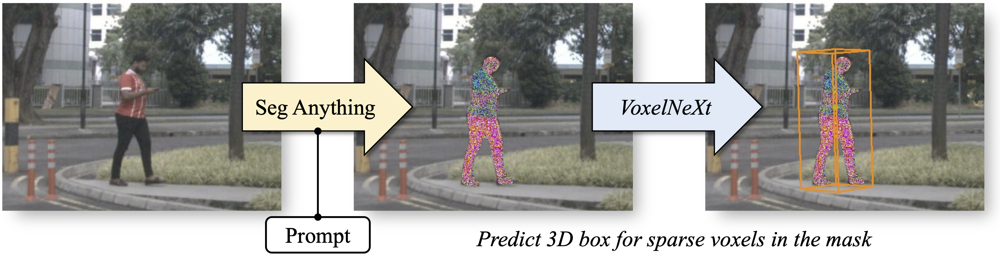
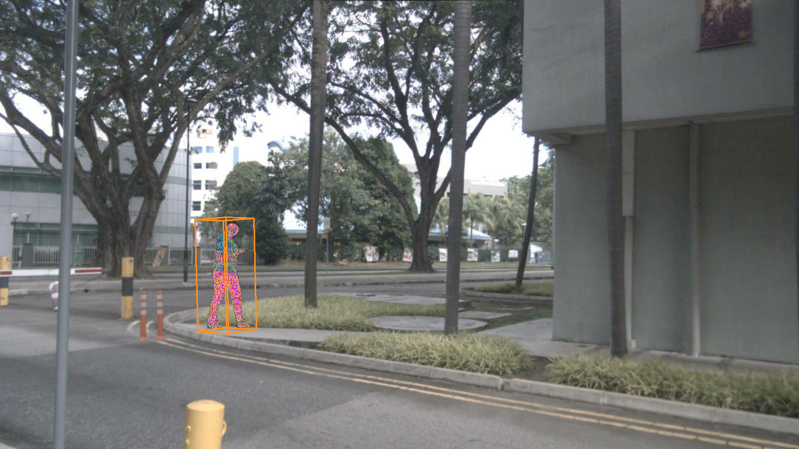
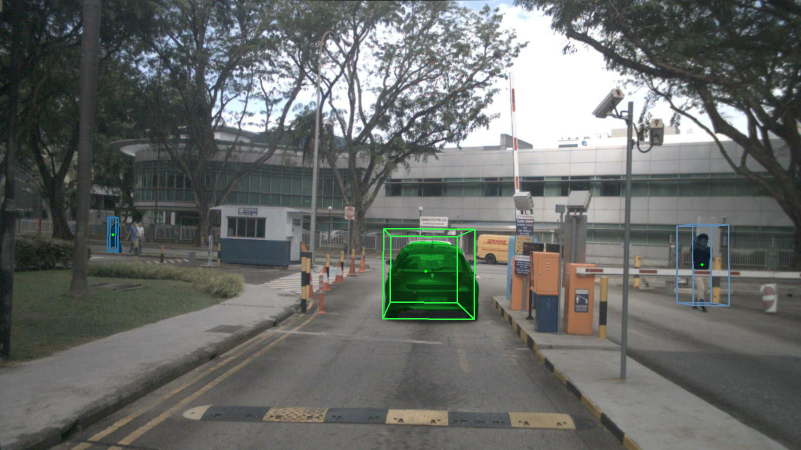
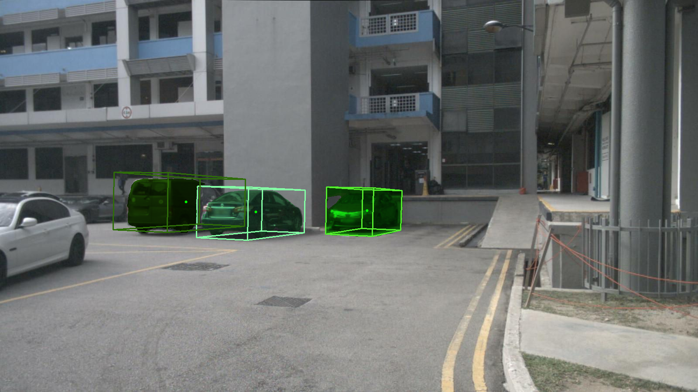

# 3D-object via Segment Anything

We extend [Segment Anything](https://github.com/facebookresearch/segment-anything) to 3D perception by combining it with [VoxelNeXt](https://github.com/dvlab-research/VoxelNeXt). Note that this project is still in progress. We are improving it and create more examples. Any issue or pull request is welcome!

<p align="center">  </p>

## Why this project?
[Segment Anything](https://github.com/facebookresearch/segment-anything) and its following projects
focus on 2D images. In this project, we extend the scope to 3D world by combining [Segment Anything](https://github.com/facebookresearch/segment-anything) and [VoxelNeXt](https://github.com/dvlab-research/VoxelNeXt). When we provide a prompt (e.g., a point / box), the result is not only 2D segmentation mask, but also 3D boxes.

The core idea is that [VoxelNeXt](https://github.com/dvlab-research/VoxelNeXt) is a fully sparse 3D detector. It predicts 3D object upon each sparse voxel. We project 3D sparse voxels onto 2D images. And then 3D boxes can be generated for voxels in the SAM mask. 

- This project makes 3D object detection to be promptable.
- VoxelNeXt is based on sparse voxels that are easy to be related to the mask generated from segment anything.
- This project could facilitate 3D box labeling. 3D box can be obtained via a simple click on image. It might largely save human efforts, especially on autonuous driving scenes.

## Installation
1. Basic requirements
`pip install -r requirements.txt
`
2. Segment anything
`pip install git+https://github.com/facebookresearch/segment-anything.git
`
3. spconv
`pip install spconv
`
or cuda version spconv `pip install spconv-cu111` based on your cuda version.


## Getting Started
Please try it via [seg_anything_and_3D.ipynb](seg_anything_and_3D.ipynb).
We provide this example on nuScenes dataset. You can use other image-points pairs. 
The point to image translation infos on nuScenes val can be download [here](https://drive.google.com/file/d/1nJqdfs0gMTIo4fjOwytSbM0fdBOJ4IGb/view?usp=share_link).

<p align="center">  </p>
<p align="center">  </p>
<p align="center">  </p>

## TODO List
- - [ ] Zero-shot version VoxelNeXt.
- - [ ] Examples on more datasets.
- - [ ] Indoor scenes.

## Citation 
If you find this project useful in your research, please consider citing:
```
@article{kirillov2023segany,
  title={Segment Anything}, 
  author={Kirillov, Alexander and Mintun, Eric and Ravi, Nikhila and Mao, Hanzi and Rolland, Chloe and Gustafson, Laura and Xiao, Tete and Whitehead, Spencer and Berg, Alexander C. and Lo, Wan-Yen and Doll{\'a}r, Piotr and Girshick, Ross},
  journal={arXiv:2304.02643},
  year={2023}
}

@inproceedings{chen2023voxenext,
  title={VoxelNeXt: Fully Sparse VoxelNet for 3D Object Detection and Tracking},
  author={Yukang Chen and Jianhui Liu and Xiangyu Zhang and Xiaojuan Qi and Jiaya Jia},
  booktitle={Proceedings of the IEEE/CVF Conference on Computer Vision and Pattern Recognition},
  year={2023}
}

```

## Acknowledgement
-  [Segment Anything](https://github.com/facebookresearch/segment-anything)
- [VoxelNeXt](https://github.com/dvlab-research/VoxelNeXt)
- [UVTR](https://github.com/dvlab-research/UVTR) for 3D to 2D translation.

## Our Works in 3D Perception
- **VoxelNeXt (CVPR 2023)** [[Paper]](https://arxiv.org/abs/2303.11301) [[Code]](https://github.com/dvlab-research/VoxelNeXt) Fully Sparse VoxelNet for 3D Object Detection and Tracking.
- **Focal Sparse Conv (CVPR 2022 Oral)** [[Paper]](https://arxiv.org/abs/2204.12463) [[Code]](https://github.com/dvlab-research/FocalsConv) Dynamic sparse convolution for high performance.
- **Spatial Pruned Conv (NeurIPS 2022)** [[Paper]](https://arxiv.org/abs/2209.14201) [[Code]](https://github.com/CVMI-Lab/SPS-Conv) 50% FLOPs saving for efficient 3D object detection.
- **LargeKernel3D (CVPR 2023)** [[Paper]](https://arxiv.org/abs/2206.10555) [[Code]](https://github.com/dvlab-research/LargeKernel3D) Large-kernel 3D sparse CNN backbone.
- **SphereFormer (CVPR 2023)** [[Paper]](https://arxiv.org/abs/2303.12766) [[Code]](https://github.com/dvlab-research/SphereFormer) Spherical window 3D transformer backbone.
- [spconv-plus](https://github.com/dvlab-research/spconv-plus) A library where we combine our works into [spconv](https://github.com/traveller59/spconv).
- [SparseTransformer](https://github.com/dvlab-research/SparseTransformer) A library that includes high-efficiency transformer implementations for sparse point cloud or voxel data.

